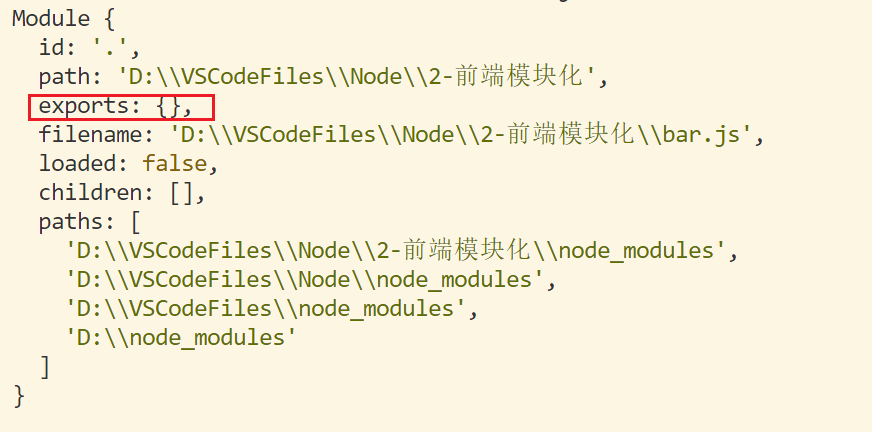

### 一、CommonJS：

commonJS 是一种规范,node 中对这个规范做了具体的实现
主要的规范有：
模块中导出使用 exports
模块中导入使用 require

#### foo 模块：

foo 模块中定义了一些变量和函数，希望在其他的模块中也能使用，那就需要导出

```javascript
const name = "foo";

function saiHello() {
  console.log("i am foo");
}
```

导出的方式为使用 exports

```javascript
const name = "foo";

function saiHello() {
  console.log("i am foo");
}

// 把这里的变量导出
// exports是一个对象，添加再上面的属性，会默认被到处
exports.name = name;
exports.saiHello = saiHello;
}
```

#### index.js 模块

index.js 模块中想使用 foo 模块，需要 require()

```javascript
// 从另一个文件中导入
const foo = require("./foo");

console.log(foo.name); //foo
console.log(foo.saiHello()); //i am foo
```

实际上`const foo = require("./foo");`  
获取到的`foo`是一个对象,也可以直接解构，就不需要使用`.`运算符

```javascript
// 从另一个文件中导入,直接对 对象解构
const { name, saiHello } = require("./foo");

console.log(name); //foo
console.log(saiHello()); //i am foo
```

### 二、exports 对象与 module.exports 对象

实际上在 CommonJS 模块规范 中每一个文件（比如一个 js 文件）都是一个模块 `module`, 模块有自己的作用域。一个文件内或者说一个模块内定义的变量、函数、类、都是私有的，对其他文件是不可见的。

一个模块内就很多代码，有些代码需要给别人用，就需要导出，module 对象有一个 exports 属性，专门用做导出用的  
`bar.js`

```javascript
// bar模块
console.log(module);
```


在使用 `exports` 或者 `module.exports` 添加导出变量的时候，实际上就是给上面这个 module 对象的 exports 属性(本身又是一个对象)添加属性。

`bar.js`

```javascript
// bar模块
const name = "bar";

function barHello() {
  console.log("hello, i am bar");
}

// 使用exports
exports.name = name;

// 使用module.exports
module.exports.barHello = barHello;
```

查看 module


实际上 `exports` 其实就是 `module.exports`，是对同一个对象的引用，它可以作为对 `module.exports` 的快捷访问  
但是如果对 module.exports 重新赋值新对象，他们就没有联系了
`bar.js`

```javascript
// bar模块
const name = "bar";
const age = 19;
const gender = "male";

function barHello() {
  console.log("hello, i am bar");
}

function saiHi() {
  console.log("hi,hi,hi ");
}

// 使用exports
exports.name = name;

// 使用module.exports
module.exports = {
  age,
  gender,
  saiHi,
};

console.log(module);
```

查看 module 对象


### 三、require()查找路径

require()是一个函数，可以帮助我们引入一个模块中导出的对象

#### require(X): 引入 node 提供的内置模块:

```javascript
const path = require("path");
const http = require("http");
```

原始

#### require(X) : 引入的是以 `./`或者`../`或`/` 开头的文件

```javascript
const a = require("./a");
```

1. 将 X 当做是一个文件去查找，按照路径查找这个文件

- 如果提供了后缀名，按照文件的路径去查找该文件
- 如果没有提供后缀名，会按照以下的顺序查找:
  1. 直接查找文件 X
  2. 查找文件 X.js
  3. 查找文件 X.json
  4. 查找文件 X.node

2. 没有找到对应的文件，将 X 当做一个目录去查找

   - 查找 X/index.js 文件
   - 查找 X/index.json 文件
   - 查找 X/index.node 文件

3. 上面都没查找到，那就是找不到，抛出 `MODULE_NOT_FOUND `的错误

#### require(X): X 既不是内置模块，也不是一个路径，属于第三方模块

```javascript
const axios = require("axios");
```

从当前目录下的 `node_modules` 目录中开始，查找是否存在该第三方模块标识符对应的文件或者目录(按照之前的查找文件或者目录的方法找)  
如果找不到，则继续往`上一级的 node_modules` 目录找，一直到根目录下的 node_modules 目录，如果根目录下的 node_modules 中也没找到，则抛出 `MODULE_NOT_FOUND` 的错误。

```javascript
[
  "/root/path/to/module/node_modules",
  "/root/path/to/node_modules",
  "/root/path/node_modules",
  "/root/node_modules",
  "/node_modules",
];
```

### 四、模块加载过程中细节

1. 模块在第一个被引入的时候，模块中的 js 代码会被执行一次
2. 模块被多次引入的时候，最后只会加载一次：

   - 因为每一个模块对象 module 都有一个属性`loaded`,初始值为 false，表示未加载，为 true 表示已加载

3. 如果模块中有循环引入，加载顺序是怎样的?
   - 所谓的循环引入模块，是指同一个模块在其他的模块中也被引入了，由于模块都有一个 loaded 属性，所以之前引入的模块不会被重新执行，而且加载的过程是深度优先的

### 五、CommonJS 的缺点：

conmonJs 加载模块是同步的，意味着只有等待对应的模块加载完毕，当前模块中的内容才能执行，如果某一个模块中有耗时的操作，则必须等待完成才会继续

这个在服务器上不会有什么问题，因为其他的文件都在服务器上，加载的都是本地文件，

如果将它应用在浏览器上，浏览器加载 js 文件需要先从服务器上将文件下载下来，之后再执行，这就意味着在下载 js 代码中，其他的代码也无法执行
