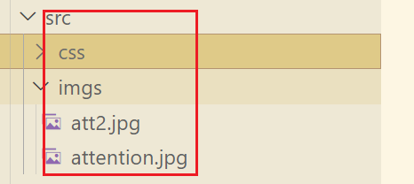

### 在 js 文件中使用图片资源

如果使用 js 生成 DOM 元素，比如创建 img 元素，设置 src 属性的时候，
需要在 js 中导入这个图片，图片作为资源使用，然后直接设置`src=图片`

```javascript
import attImgs from "../src/imgs/attention.jpg";

// 创建img元素
const imgEl = document.createElement("img");
imgEl.src = attImgs;
document.body.append(imgEl);
```

在`webpack.config.js`的配置如下：

```javascript
      // 处理图片
      {
        test: /\.(png|jpe?g|svg|gif)$/,
        type: "asset",
      },
```

### 在 css 文件中使用图片资源

在 css 文件中需要引入一个文件，直接使用路径引入即可。比如设置元素的背景图
`js代码`

```javascript
// 创建div元素，设置背景图
const divBgEl = document.createElement("div");
divBgEl.classList.add("divcls");
document.body.append(divBgEl);
```

`css代码`

```css
.divcls {
  width: 50px;
  height: 50px;
  background: url(../imgs/attention.jpg);
}
```

但是需要在某一个（入口？）js 文件中引入这个图片资源,进入到 webpack 的依赖图中
（PS，好像直接在 css 中引入就可以了，不需要下面这句了）

```javascript
import "../src/imgs/attention.jpg";
```

如果之前引入了相同的资源，可以不再引入（cssd 的话，不需要手动引入？）

### 做了什么

- 当 `type: "asset/resource"`  
  实际上把之前的文件复制到了打包文件夹，然后使用哈希重命名了，在把这两张图片的路径设置到 bundle.js 中对应的位置
  
  

- 当 `type: "asset/inline",`  
  build 文件夹下面只有 bundle.js 文件，没有图片资源文件  
  

  这时候是对 src 文件下的图片进行了编码 base64 编码，把编码后的源代码放到了 bundle.js 文件中了  
    
  `bundle.js`  
  
  浏览器解析源码

  #### 优势：

  少发送一些网络请求， `type: "asset/resource"`会拷贝 src 下的图片文件 问打包目录下，这样浏览器在请求对应的图片的时候，需要发送网络请求下载对应的图片，但但是当`type: "asset/inline"`时候，浏览器在请求`js`代码的时候就已经包含了图片的编码代码，不用在发送额外的网络请求了

  #### 劣势：

  但是图片编码放在了 js 文件中，会导致 js 文件变大 ，下载 js 文件本身的时候会变长，引入 js 脚本的时候如果没有加 `defer` 或者 `async` 关键字，就会造成 DOM 解析阻塞

  #### 合适的做法

  对于一些小的图片，可以使用 base64 编码，因为小图片不大， 编码后文件也不会很大。  
  但是对于一些大的图片，单独的图片打包，形成 url 地址，单曲的请求这个 url 图片

### 综合方法

1. 使用`type: "asset"`
2. 添加 parser 属性，制定 dataUrl 条件，添加 maxSize 属性：小于这个大小，使用编码，大于这个文件大小，单独打包
   ```javascript
   {
      test: /\.(png|jpe?g|svg|gif)$/,
      type: "asset",
      parser: {
        dataUrlCondition: {
          // 单位值Byte(B)  ->  1024B = 1KB
          //当图片尺寸小于60*1024B = 60KB的时候，使用base64编码图片，放在js文件中，
          //图片尺寸大于60KB的时候，图片会被单独打包
          maxSize: 60 * 1024,
        },
      },
   },
   ```
3. 这时候，build 目录下面只有一张图片了，另外一张小点的使用了 base64 编码放进了 js 文件中
   

### 打包之后的资源文件的重命名

上面在打包图片以后，生成的文件名是`3d39db6f755c148d816a.jpg`这样的，如果希望保留之前的名字，同时也保留这样 的哈希码，可以用下面的配置：

```javascript
{
        test: /\.(png|jpe?g|svg|gif)$/,
        type: "asset",
        parser: {
          dataUrlCondition: {
            // 单位值Byte
            maxSize: 60 * 1024,
          },
        },
        generator: {
          // 使用占位符
          /*
          1. name 指向原来的图片名称，
          2. ext 原来的文件的扩展名
          3. hans webpack生成的哈希值,
           */
          filename: "[name]_[hash:8][ext]",
        },
      },
```

这时候打包以后的文件的名称就是保留了原文件名，和哈希值  


为了让图片资源单独的在一个文件夹下面，可以在前面加上目录名称

```javascript
filename: "img/[name]_[hash:8][ext]",
```


### 一个细节

项目中图片引用的是打包以后的资源的路径，比如，图片打包以后位置在目录`img/`下 ,而且保留了哈希值
则 img 元素的 src 为

