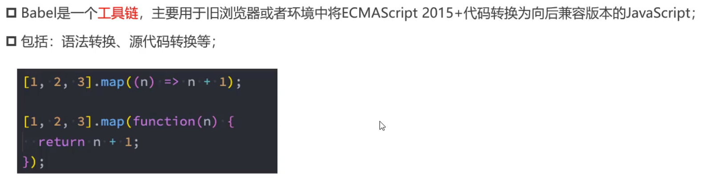

### babel 是什么

Babel 是一个 javascript 编译器，可以将最新版本的 Javascript 语法 转换为向后兼容的代码，以便在旧版浏览器或者其他环境中运行。Babel 的作用是让我们使用最新的 javascript 语法特性，同时不必担心浏览器是否支持这些特性。
比如使用 Babel 将 ES6+ 代码转换成浏览器兼容的 ES5 代码。例如箭头函数、解构赋值、const 关键字等。



Babel 是对 js 文件的打包，如果不使用 babel，webpack 也会对 js 文件打包。比如  
`sum.js`

```javascript
const sum = (a, b) => {
  return a + b;
};
export default sum;
```

`index.js`

```javascript
import sum from "./src/js/sum";
console.log(sum(2, 1));
console.log(sum(10, 20));

const arr = [];
arr.push(1);
console.log(arr);

let set = new Set();
set.add(1);
console.log(set);
```

webpack 打包以后的代码：  
`bundle.js`

```javascript
(() => {
  "use strict";
  const o = (o, l) => o + l;
  console.log(o(2, 1)), console.log(o(10, 20));
  const l = [];
  l.push(1), console.log(l);
  let s = new Set();
  s.add(1), console.log(s);
})();
```

可以发现`箭头函数`、`const`、`let`, 这些 ES 的新特性仍然保留，这样在一些旧浏览器中，可能不支持这些语法，就会无法运行，这时候就需要使用 babel。

### 使用 Babel

1. 安装 Babel  
   babel 也是一个 loader

```javascript
yarn add babel-loader
yarn add @babel/core
```

针对 js 文件，使用 babel-loader，配置`webpack.config.js`

```javascript
{
  test: /\.js$/,
  use: ["babel-loader"],
},
```

这里仅仅是安装了 Babel 的核心模块，现在 Babel 还不能对代码进行转换，比如打包代码：
`yarn run build`

```javascript
// 代码并没有转换为ES5语法
(() => {
  "use strict";
  const o = (o, l) => o + l;
  console.log(o(2, 1)), console.log(o(10, 20));
  const l = [];
  l.push(1), console.log(l);
  let s = new Set();
  s.add(1), console.log(s);
})();
```

2.  Babel 的使用
    如果我们希望 Babel 可以把`箭头函数`转为普通函数，或者 `const` 关键字转为 `var`,我们还需要使用插件对 babel 进行扩展

    - 安装箭头函数转换相关的插件  
       `yarn add @babel/plugin-transform-arrow-functions -D`  
       配置 babel，让它使用插件：
      ```javascript
      //babel配置
      {
       test: /\.js$/,
       use: {
         loader: "babel-loader",
         options: {
           plugins: ["@babel/plugin-transform-arrow-functions"],
         },
       },
      },
      ```
      打包以后的代码:
      ```javascript
      (() => {
        "use strict";
        //原本的箭头函数变成了普通函数
        const o = function (o, n) {
          return o + n;
        };
        console.log(o(2, 1)), console.log(o(10, 20));
        const n = [];
        n.push(1), console.log(n);
        let e = new Set();
        e.add(1), console.log(e);
      })();
      ```
    - 安装 const 关键字转换
      `npm add @babel/plugin-transform-block-scoping -D`  
      配置 babel，让它使用插件：

      ```javascript
            {
         test: /\.js$/,
         use: {
           loader: "babel-loader",
           options: {
             plugins: [
               "@babel/plugin-transform-arrow-functions",
               "@babel/plugin-transform-block-scoping",
             ],
           },
         },
       },
      ```

      转换以后的代码：

      ```javascript
      (() => {
        "use strict";
        //箭头函数转化
        const o = function (o, n) {
          return o + n;
        };
        console.log(o(2, 1)), console.log(o(10, 20));
        //const关键字转换
        var n = [];
        n.push(1), console.log(n);
        //let 关键字转换
        var e = new Set();
        e.add(1), console.log(e);
      })();
      ```

    - 如果我们对 babel 配置了很多的插件，`webpack.config.js`中代码就比较多,还可以将 babel 相关的配置单独抽取出来  
      创建文件`babel.config.js`:

      ```javascript
      module.exports = {
        plugins: [
          "@babel/plugin-transform-arrow-functions",
          "@babel/plugin-transform-block-scoping",
        ],
      };
      ```

      这样在 `webpack.config.js` 中关于 babel 的配置就可以变成：

      ```javascript
      // 使用babel
      {
        test: /\.js$/,
        use: {
          loader: "babel-loader",
        },
      },
      ```

      直接`npm run build`:

      ```javascript
      (() => {
        "use strict";
        const o = function (o, n) {
          return o + n;
        };
        console.log(o(2, 1)), console.log(o(10, 20));
        var n = [];
        n.push(1), console.log(n);
        var e = new Set();
        e.add(1), console.log(e);
      })();
      ```

    - 另外如果我们使用一个功能就安装一个插件，这是非常麻烦的，所以这时候有了`@babel/preset-env`预设, 预设中已经配置好了需要使用的插件  
      安装预设`yarn add @babel/preset-env -D`  
      配置`babel.config.js`

      ```javascript
      module.exports = {
        // plugins: [
        //   "@babel/plugin-transform-arrow-functions",
        //   "@babel/plugin-transform-block-scoping",
        // ],
        presets: ["@babel/preset-env"],
      };
      ```

      打包：`yarn run build`

      ```javascript
      (() => {
        "use strict";
        const o = function (o, n) {
          return o + n;
        };
        console.log(o(2, 1)), console.log(o(10, 20));
        var n = [];
        n.push(1), console.log(n);
        var e = new Set();
        e.add(1), console.log(e);
      })();
      ```
