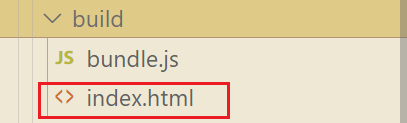
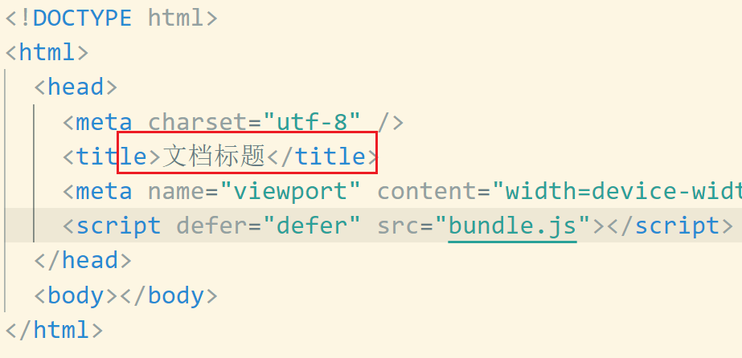
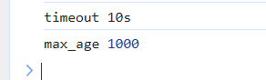

### loader 和 plugin

loader 通常是用来对某些`特定的模块`进行转换的，比如`.css`,`.vue`文件
plugin 可以用于执行更加广泛的任务，比如  
打包优化（css 文件抽取成单独文件）  
资源管理（删除上一次遗留的打包文件）  
环境变量注入（DefinePlugin 注入变量）等

### Clean 插件

每次修改文件，重新打包以后，都需要手动的删除 build 文件夹下面的文件,有插件可以让我们每次打包时，自动删除打包文件夹下面的其他文件

安装`yarn add clean-webpack-plugin`

配置`webpack.config.js`：

```javascript
const { CleanWebpackPlugin } = require("clean-webpack-plugin");

module.exports = {
  entry: "./index.js",
  output: {
    filename: "bundle.js",
    path: path.resolve(__dirname, "./build"),
  },
  mode: "production",
  plugins: [new CleanWebpackPlugin()],
};
```

### Html 插件

我们使用` webpack` 产生了打包文件，放在了 `build `目录下面，这个目录下面就包含了我们需要使用的 js 、css 文件。我们部署到服务器上时，就是直接把整个 build 目录拿过去，但是问题是现在没有对应的`html`文件，这个 html 文件需要引入 bundle.js 文件,可以使用一个插件自动生成一个配置好的 html 文件

安装`yarn add html-webpack-plugin`

配置`webpack.config.js`:

```javascript
const HtmlWebpackPlugin = require("html-webpack-plugin");

  plugins: [
    new CleanWebpackPlugin(),
    new HtmlWebpackPlugin({
      // 网页的标题
      title: "文档标题",
    }),
  ],
```

`build`目录  


`index.html`文件


实际上生成的 html 文件是根据`\node_modules\html-webpack-plugin\default_index.ejs`模板来生成的，我们也可以指定一个新的模板

```html
<!-- default_index.ejs -->
<!DOCTYPE html>
<html>
  <head>
    <meta charset="utf-8" />
    <title><%= htmlWebpackPlugin.options.title %></title>
  </head>
  <body></body>
</html>
```

指定新模板，需要配置：

```javascript
new HtmlWebpackPlugin({
      // 网页的标题
      title: "文档标题",
      // 配置模板文件
      // template:"xxx.html"
    }),
```

### DefinePlugin 插件

这个插件可以给整个项目中注入一些全局变量，你可以在任何位置、文件中使用这些变量。是一个 webpack 内置的插件，不需要单独的安装

```javascript
const { DefinePlugin } = require("webpack");

new DefinePlugin({
  // 存放键值对，变量-值
  TIMEOUT: "'10s'",
  MAX_AGE: "1000",
}),
```

在项目中的其他文件中使用这个变量

```javascript
//index.js
// 使用DefinePlugin注入的全局变量
console.log("timeout", TIMEOUT);
console.log("max_age", MAX_AGE);
```

控制台输出  

