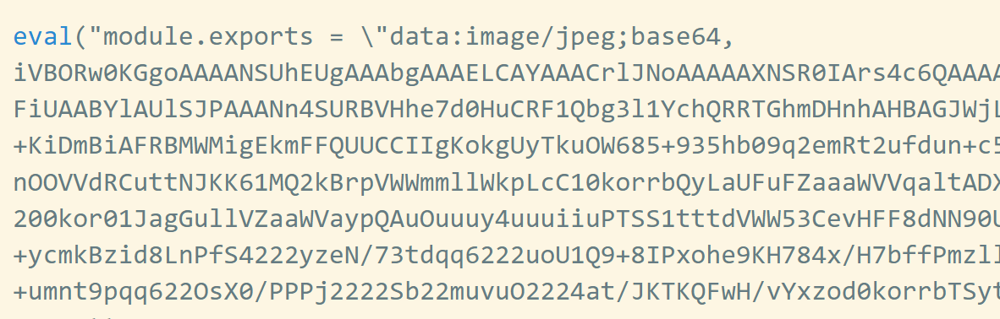

### 在 js 文件中使用图片资源

如果使用 js 生成 DOM 元素，比如创建 img 元素，设置 src 属性的时候，
需要在 js 中导入这个图片，图片作为资源使用，然后直接设置`src=图片`

```javascript
import attImgs from "../src/imgs/attention.jpg";

// 创建img元素
const imgEl = document.createElement("img");
imgEl.src = attImgs;
document.body.append(imgEl);
```

在`webpack.config.js`的配置如下：

```javascript
      // 处理图片
      {
        test: /\.(png|jpe?g|svg|gif)$/,
        type: "asset",
      },
```

### 在 css 文件中使用图片资源

在 css 文件中需要引入一个文件，直接使用路径引入即可。比如设置元素的背景图
`js代码`

```javascript
// 创建div元素，设置背景图
const divBgEl = document.createElement("div");
divBgEl.classList.add("divcls");
document.body.append(divBgEl);
```

`css代码`

```css
.divcls {
  width: 50px;
  height: 50px;
  background: url(../imgs/attention.jpg);
}
```

但是需要在某一个（入口？）js 文件中引入这个图片资源,进入到 webpack 的依赖图中
（PS，好像直接在 css 中引入就可以了，不需要下面这句了）

```javascript
import "../src/imgs/attention.jpg";
```

如果之前引入了相同的资源，可以不再引入（cssd 的话，不需要手动引入？）

### 做了什么

- 当 `type: "asset/resource"`  
  实际上把之前的文件复制到了打包文件夹，然后使用哈希重命名了，在把这两张图片的路径设置到 bundle.js 中对应的位置
  
  

- 当 `type: "asset/inline",`  
  build 文件夹下面只有 bundle.js 文件，没有图片资源文件  
  

  这时候是对 src 文件下的图片进行了编码 base64 编码，把编码后的源代码放到了 bundle.js 文件中了
  
  
  浏览器解析源码

  #### 优势：

  少发送一些网络请求， `type: "asset/resource"`会请求 src 下的图片文件

  #### 劣势：

  但是图片编码放在了 js 文件中，会导致 js 文件变大 ，下载 js 文件本身的时候会变长

  #### 合适的做法

  对于一些小的图片，可以使用 base64 编码，因为小图片不大， 编码后文件也不会很大。  
  但是对于一些大的图片，单独的图片打包，形成 url 地址，单曲的请求这个 url 图片

### 综合方法

1. 使用`type: "asset"`
2. 添加 parser 属性，制定 dataUrl 条件，添加 maxSize 属性：小于这个大小，使用编码，大于这个文件大小，单独打包
