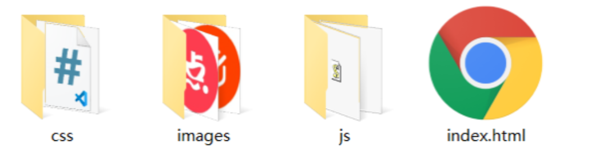

### SPA 是什么

单页面应用程序（Single Page Application）简称 SPA,指的是 Web 网站中只要唯一的一个`HTML`页面,所有的功能与交互都是在这个一个页面内完成的：
比如这样的一个 demo 项目：

### 单页面应用程序的特点：

单页面应用程序将所有的功能局限于一个 web 页面中，仅在该 web 页面初始化时加载相应的资源（HTML、 JavaScript 和 CSS）。
一旦页面加载完成了，SPA 通常不会因为用户的操作而进行页面的重新加载或跳转，而是利用 JavaScript 动态地变换`HTML`的内容，从而实现页面与用户的交互。

### 多页面 MPA ：

多页面 MPA 就是指多页应用，每一个页面都是一个主页面，都对应这一套 html,css,javascrit，页面之间进行跳转的时候，需要重新请求新的 html，css,js 文件。
以上图为例：比如首页对应一套 html，css,js 代码，会员页面也对应一套 html，css,js 代码，两个页面之间切换的时候，需要重新发送 http 请求。  
但是单页面 SPA 则是这整个项目只对应一套 html，css,js 代码，页面之间切换不会请求新的 html 文件，与用户的交互，内容的动态渲染则是通过 AJAX 来完成。

### 单页面 SPA 的优缺点：

- 单页面的优点：

  1. 页面的切换速度快，用户体验好，内容的改变不需要加载整个页面，减轻了服务器的压力
  2. 对应着第一点，则是代码分工更明确，良好的前后端分离，以前后端做的事，现在前端可以做

- 单页面的缺点：

  1. 首次渲染速度相对较慢

     1. 路由懒加载
     2. 代码压缩
     3. CDN 加速
     4. 网络传输压缩

  2. 不利于 seo, 搜索引擎优化
     1. 可利用服务器端渲染(SSR)优化

- 适用范围：  
  高要求的体验度、追求界面流畅幻彩的应用，或者追求高性能的网页流畅度，以及其后台分离的项目。比如企业内部解决方案、零售业解决方案等等

单页面一般做手机 app 比较多，现在大多数手机 app 的套壳都是单页面应用。

### 多页面 MPA 的优缺点：

- 优点：
  1. 首屏加载快
  2. seo 优化好，搜索引擎优化比较容易
- 缺点：

  1. 由于基本上是后台控制和渲染页面，页面切换加载缓慢，流畅度不够，用户体验比较差
  2. 对于后端依赖性比较强，依赖 url 传参、或者 cookie 、localStorage 等
  3. 由于是前后端合在一起的，就会导致如果是纯前端开发人员来做，可能做不了 ，可能还需要后端帮忙一起调试，就会照成效率下降

- 适用范围：  
  适用于追求 SEO 优化比较好，比较注重搜索引擎爬虫抓取比较友好的应用，比如博客系统、cms 系统、门户网站等等
