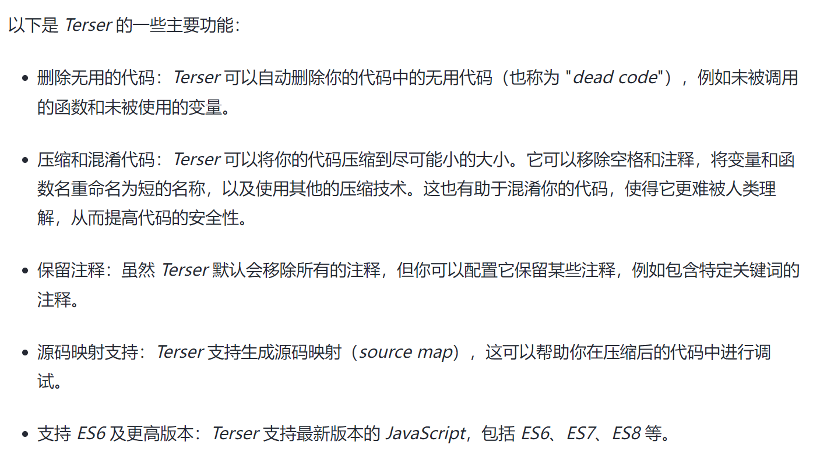
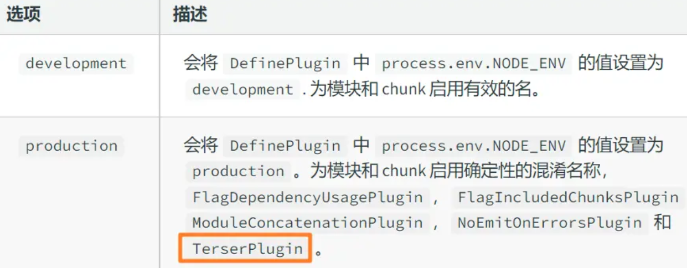

### 什么是首屏加载

首屏时间（First Contentful Paint），指的是浏览器从响应用户输入网址地址，到首屏内容渲染完成的时间，此时整个网页不一定要全部渲染完成，但需要展示当前视窗需要的内容

### 加载慢的原因

- 资源文件体积是否过大
- 资源是否重复发送请求去加载了

### 解决方案

1.  减小入口文件体积:  
     这里涉及到模块打包的概念:我们首先知道，spa 应用通常最终打包后的代码只有一个 html 文件，一个 css 文件，一个 js 文件。当我们请求了 html 文件以后，遇到 js 脚本，需要下载并执行脚本。由于 js 代码都在一个脚本中，这些代码都需要执行，但是有些代码可能只有在某些很少的情况下才会触发并执行，所以我们能不能把这部分很少用的代码，不要和其他代码打包在一起，而是单独打包，只有在触发了对应的操作的时候才去请求这部分脚本然后执行它，这样不就是减少了代码体积，也加快了首屏速度。
    所以我们就需要 `code splitting` 这样的功能来实现按需加载。而不是把那些很少人才会用到的代码一股脑儿全都下载到客户端去。

    - 路由的懒加载：
      把不同路由对应的组件分割成不同的代码块，待路由被请求的时候会单独打包路由，使得入口文件变小，加载速度大大增加
      以函数的形式加载路由，这样就可以把各自的路由文件分别打包，只有在解析给定的路由时，才会加载路由组件
      ```javascript
      routes:[
      path: 'Blogs',
      name: 'ShowBlogs',
      component: () => import('./components/ShowBlogs.vue')
      ]
      ```
    - UI 框架按需加载:
      - 动态的加载使用到的组件，而不是引入整个 UI 库
    - 图片资源的压缩:
      - 图片适当的压缩
      - 使用雪碧图
    - 图片的懒加载
    - 代码压缩：

      - **Terser** :Terser 是一个流行的 JavaScript 解析器和压缩器，它可以帮助你优化 JavaScript 代码以减少其大小，从而提高 web 页面的加载速度。
        
        在 webpack 配置文件 webpack.config.js 中通过将 mode 设置为 development 或者 production，会对代码进行不同的处理。
        

        TerserPlugin 处理代码依赖的是 terser 这个工具， terser 是可以直接安装并独立使用的，使用的时候有非常多的配置可以自行定义。  
        terser 是一个工具，有着压缩、转换处理 js 代码等功能，通过命令行可以直接对 js 文件进行编译。

        但在项目中，直接使用 terser 过于繁琐，所以借助 terser-webpack-plugin 统一编译，当 mode 为 production 时，有默认的配置，也可以自行定义处理规则。 - 组件的重复打包： - 多个路由使用相同文件，可能会重复下载

      - Gzip 压缩
        依托与服务器端

2.  静态资源本地缓存
    - http 缓存
    - 浏览器缓存
