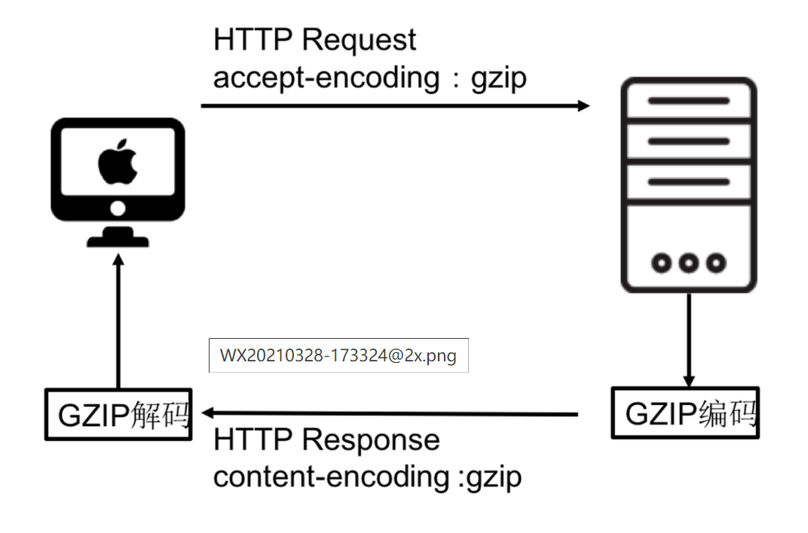
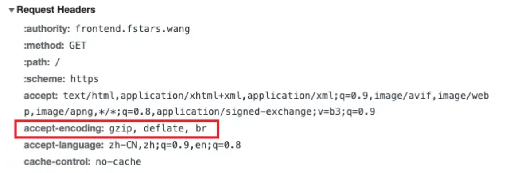
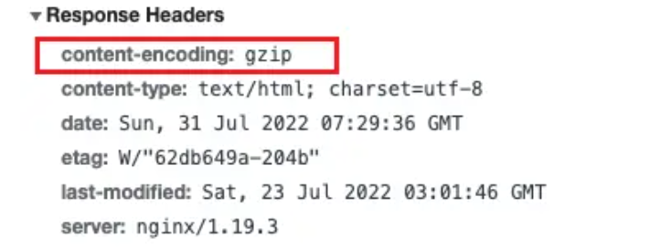

### 什么是首屏加载

首屏时间（First Contentful Paint），指的是浏览器从响应用户输入网址地址，到首屏内容渲染完成的时间，此时整个网页不一定要全部渲染完成，但需要展示当前视窗需要的内容

### 加载慢的原因

- 资源文件体积是否过大
- 资源是否重复发送请求去加载了

### 解决方案

1.  减小入口文件体积:  
     这里涉及到模块打包的概念:我们首先知道，spa 应用通常最终打包后的代码只有一个 html 文件，一个 css 文件，一个 js 文件。当我们请求了 html 文件以后，遇到 js 脚本，需要下载并执行脚本。由于 js 代码都在一个脚本中，这些代码都需要执行，但是有些代码可能只有在某些很少的情况下才会触发并执行，所以我们能不能把这部分很少用的代码，不要和其他代码打包在一起，而是单独打包，只有在触发了对应的操作的时候才去请求这部分脚本然后执行它，这样不就是减少了代码体积，也加快了首屏速度。
    所以我们就需要 `code splitting` 这样的功能来实现按需加载。而不是把那些很少人才会用到的代码一股脑儿全都下载到客户端去。

    - 路由的懒加载：
      把不同路由对应的组件分割成不同的代码块，待路由被请求的时候会单独打包路由，使得入口文件变小，加载速度大大增加
      以函数的形式加载路由，这样就可以把各自的路由文件分别打包，只有在解析给定的路由时，才会加载路由组件
      ```javascript
      routes:[
      path: 'Blogs',
      name: 'ShowBlogs',
      component: () => import('./components/ShowBlogs.vue')
      ]
      ```
    - UI 框架按需加载:
      - 动态的加载使用到的组件，而不是引入整个 UI 库
    - 图片资源的压缩:
      - 图片适当的压缩
      - 使用雪碧图
    - ## 图片的懒加载：

      - img 标签：
        - 把需要懒加载的图片的 url 添加到 data-src 属性，判断需要懒加载的图片是否在视口内，常用的判断方法就是`getBoundingClientRect`,图片到了视口内，就把 data-src 属性赋值给 src 属性，最后判断是否所有需要懒加载的图片已经完成，再移除事件。
        - 另一个新的 API:`Intersection Observer`
      - background 形式的懒加载: -用 css 选择器来控制 background-image 是否加载.有 lazy 类时候 background-image: none;,元素进入视口后移除选择器，相应图片的地址就可以加载出来了
        ```html
        <div class="img img-1"></div>
        <div class="img img-2"></div>
        <div class="img img-3 lazy"></div>
        <div class="img img-4 lazy"></div>
        <div class="img img-5 lazy"></div>
        ```
        css：
        ```css
        .img.lazy {
          background-image: none;
        }
        .img-1 {
          background-image: url(https://img.dpm.org.cn/Uploads/Picture/2021/05/31/s60b446b015652.jpg);
        }
        ```
      - js 事件触发： - 需要注意的是有三种事件都可能导致图片的可视数量发生变化：`scroll`,`resize` 和 `oritentionChange`

        ```javascript
        document.addEventListener("scroll", lazyload);
        window.addEventListener("resize", lazyload);
        window.addEventListener("orientationChange", lazyload);
        ```

    - 代码压缩：

      - **Terser** :Terser 是一个流行的 JavaScript 解析器和压缩器，它可以帮助你优化 JavaScript 代码以减少其大小，从而提高 web 页面的加载速度。
        
        在 webpack 配置文件 webpack.config.js 中通过将 mode 设置为 development 或者 production，会对代码进行不同的处理。
        

        TerserPlugin 处理代码依赖的是 terser 这个工具， terser 是可以直接安装并独立使用的，使用的时候有非常多的配置可以自行定义。  
        terser 是一个工具，有着压缩、转换处理 js 代码等功能，通过命令行可以直接对 js 文件进行编译。

        但在项目中，直接使用 terser 过于繁琐，所以借助 terser-webpack-plugin 统一编译，当 mode 为 production 时，有默认的配置，也可以自行定义处理规则。 - 组件的重复打包： - 多个路由使用相同文件，可能会重复下载

      - Gzip 压缩：
        - 参考：[前端访问优化之 gzip 压缩](https://www.shengshunyan.xyz/2021/03/28/%E5%89%8D%E7%AB%AF%E8%AE%BF%E9%97%AE%E4%BC%98%E5%8C%96%E4%B9%8Bgzip%E5%8E%8B%E7%BC%A9/#%E8%83%8C%E6%99%AF)  
          日常工作中，传输大文件之前都会用压缩工具压缩一下，然后再发送给对方，节省传输时间。能不能在浏览器请求前端静态资源的过程中，也是用这种方式呢？这就用到了 gzip 压缩  
          HTTP 协议上的 gzip 编码是一种用来改进 web 应用程序性能的技术，web 服务器和客户端（浏览器）必须共同支持 gzip。目前主流的浏览器，Chrome,firefox,IE 等都支持该协议。常见的服务器如 Apache，Nginx，IIS 同样支持 gzip
        - 客户端和服务器之间是如何通信来支持 gzip 的呢？
          1. 浏览器请求 url，并在 **request header** 中设置属性 `accept-encoding:gzip`。表明浏览器支持 gzip。
          2. 服务器收到浏览器发送的请求之后，判断浏览器是否支持 gzip，如果支持 gzip，则向浏览器传送压缩过的内容，不支持则向浏览器发送未经压缩的内容。一般情况下，浏览器和服务器都支持 gzip，**response headers** 返回包含 `content-encoding:gzip`
          3. 浏览器接收到服务器的响应之后判断内容是否被压缩，如果被压缩则解压缩显示页面内容。
             
             请求头
             
             响应头
             

1.  静态资源本地缓存
    - http 缓存
    - 浏览器缓存
