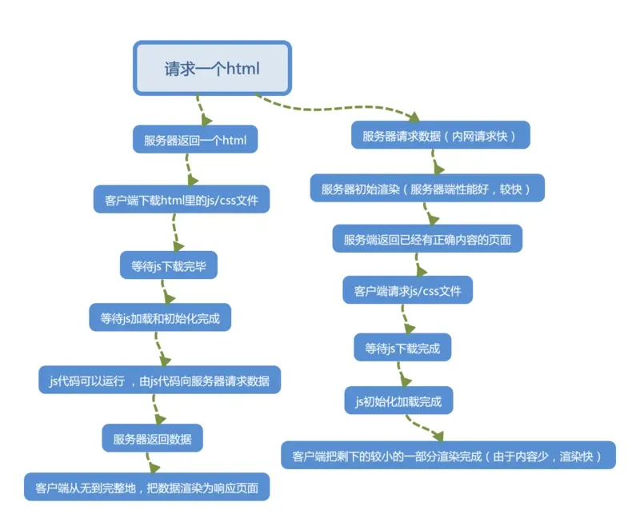

### 什么是 SEO:

搜索引擎优化，又称为 `SEO`，即 `Search Engine Optimization`，它是一种通过分析搜索引擎的排名规律，了解各种搜索引擎怎样进行搜索、怎样抓取互联网页面、怎样确定特定关键词的搜索结果排名的技术。搜索引擎采用易于被搜索引用的手段，对网站进行有针对性的优化，提高网站在搜索引擎中的自然排名，吸引更多的用户访问网站，提高网站的访问量，提高网站的销售能力和宣传能力，从而提升网站的品牌效应。

### 为什么单页面应用 SPA 的 SEO 不友好

因为单页面的情况下页面中的很多内容，都是根据匹配到的路由动态生成的，而且很多的内容都是通过 AJAX 异步获取的，网络抓取工具并不会等待异步请求完成后再进行抓取页面的内容，对于网络抓取工具来说它更擅长对静态资源的抓取和分析

### 如何解决单页面 SEO 不友好的问题

搜索引擎蜘蛛或者网络爬虫，更擅长对静态资源的抓取和更新，所以我们需要采取响应的策略生成尽可能多的静态资源让网络爬虫获取更多的数据，从而提升网站的搜索排名。

- SSR:服务器端渲染  
  为了更好的理解服务端渲染，我们可以将服务端渲染与客户端渲染对比着来看。

  - **客户端渲染：**
    前端做视图和交互，后端只提供接口数据，前端通过 `ajax` 向服务端请求数据，获取到数据后通过 `js` 生成 `DOM` 插入 `HTML` 页面，最终渲染给用户。页面代码在浏览器源代码中看不到,因为 html 代码是通过 js 动态生成的。

    **客户端渲染优点：**

    1. 使得服务器计算压力变轻
    2. 做到了前后端分离，在团队开发中只要负责各自的任务即可，使开发效率有明显提升。

  - **服务端渲染:**

    - 服务端在返回 html 之前，在特定的区域，符号里用数据填充生成 html，再发送给客户端 html，客户端解析 html 最终渲染出页面给用户，页面代码在浏览器源代码中看得到.

    服务端渲染的优点：

    - 响应快，用户体验好，首屏渲染快
    - 对搜索引擎友好，搜索引擎爬虫可以看到完整的程序源码，有利于 SEO

    服务端渲染缺点：

    - 增加了服务器的计算压力，消耗服务器性能
    - 不容易维护，如果不使用 node 中间层，前后端分工不明，不能进行良好的并行开发

    **渲染对比**  
     客户端渲染请求数据，需要经历从 js 加载完成到数据请求完成再到渲染页面，生成 DOM,插入到页面中。比价消耗时间和浏览器的性能  
    服务端渲染则是，服务器再内网请求，数据响应快，可以先请求数据再渲染可视部分然后返回给客户端，客户端再做二次渲染,这样大部分消耗的是服务端的性能。客户端页面响应时间也更快。  
    两种渲染方式
    
