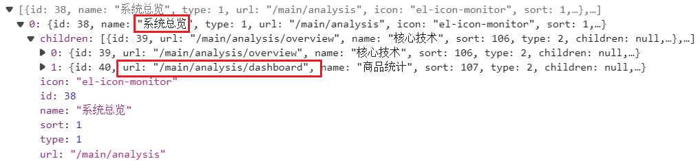
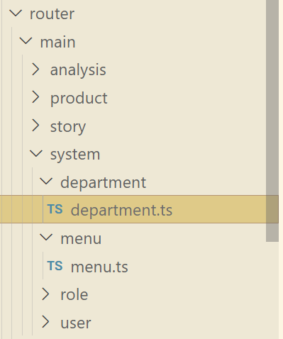
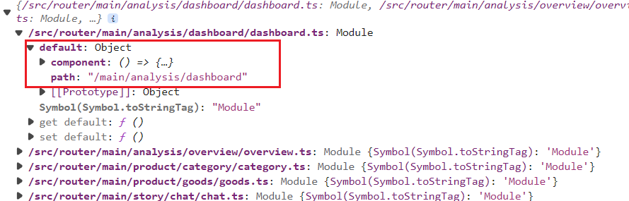

# 动态路由实现的具体步骤

1. 用户在登录的之后，需要保存一些关键信息，比较id
2. 根据用户的`id`，可以到后台查询到这个用户对应的菜单信息，可以知道这个用户需要显示哪些菜单，查询的接口是`{{baseURL}}/role/{id}/menu`
   - 返回的菜单信息如下：
   - 
3. 现在已经知道了该用户需要展示哪些菜单了，下面就是动态的匹配这些菜单
4. 用户的菜单实际上就是路由，有没有某一个菜单，就是能不能进入到某一个路由下面。我们需要把所有的路由都事先写好：
   - 写好`js`文件或者`ts`文件，比如部门页面，对应一个`department.ts`文件：
     ```javascript
     export default {
     path: '/main/system/department',
     component: () => import('@/views/main/system/department/department.vue')}`
     ```
   - 像这样把每一个菜单对应的路径和对应的组件，都事先写在文件中，把所有的菜单统一好放在合适的文件夹中,类似下面这样
   - 
5. 之后使用`import.meta.glob`动态的从文件导入模块（暂时还不太了解）
   - 把`module.default`属性值都加入到数组中保存起来
   ```javascript
   const files: Record<string, any> = import.meta.glob('@/router/main/**/*.ts', {
   eager: true})
   ```
   `files`是一个对象，结构是这样的：文件的路径作为`key`,内部的代码作为`value,`
   
6. 这样拿到了所有的菜单的路由信息，以及对应的组件，需要存储到一个数组中。之后则根据用户的菜单信息，筛选匹配的菜单
7. 遍历用户的菜单信息，从全部的菜单信息中匹配出一致的，这个过程中可以添加一个父级菜单的默认跳转路由，匹配一致的:根据`path`属性匹配，匹配一致的就可以直接加入到一个`routes数组`中,最后统一的加入到路由中
8. 默认的跳转路由可以用几个变量保存判断即刻实现
