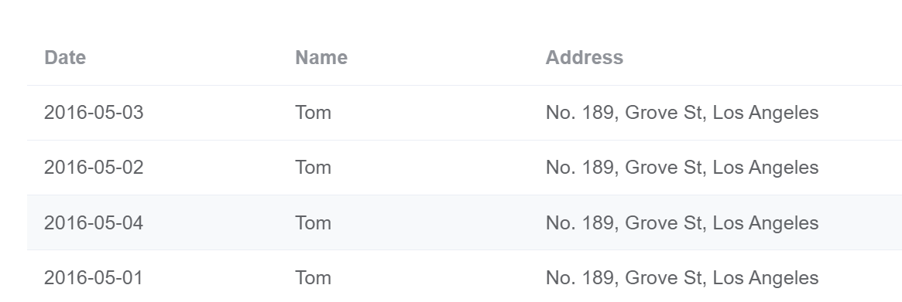

### 关于 element-plus 中 table 组件的使用

比如展示下面这样的表格：


我们首先要有数据，数据是一个数组，数组中的每一个 item 是一个个对象，这样的一个对象，表示的就是表格中的一行数据。

```javascript
const tableData = [
  {
    date: "2016-05-03",
    name: "Tom",
    address: "No. 189, Grove St, Los Angeles",
  },
  {
    date: "2016-05-02",
    name: "Tom",
    address: "No. 189, Grove St, Los Angeles",
  },
  {
    date: "2016-05-04",
    name: "Tom",
    address: "No. 189, Grove St, Los Angeles",
  },
  {
    date: "2016-05-01",
    name: "Tom",
    address: "No. 189, Grove St, Los Angeles",
  },
];
```

组件的结构：

```javascript
<el-table :data="tableData" style="width: 100%">
  <el-table-column prop="date" label="Date" width="180" />
  <el-table-column prop="name" label="Name" width="180" />
  <el-table-column prop="address" label="Address" />
</el-table
```

这个组件定义了整个表格的结构，有哪些列，列的名称叫什么，每一个 `el-table-column `就是一列的信息。没有看过源码，`tableData` 是整个表格的数据数组，内部应该会遍历这个数组，每一个对象是表格的一行，然后按照 `prop` 值，把对象的对应的 `key `的` value` 值绑定到列上面。  
所以`prop`值，必须对应着数据对象中的某一个`key`,
