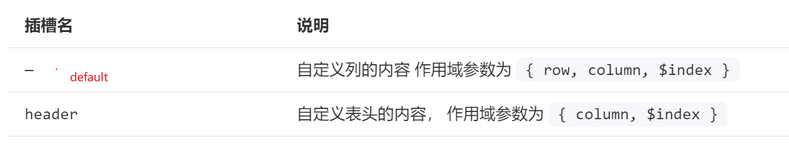

### 一、理解插槽

### 二、理解作用域插槽

作用域插槽，是在我定义一个组件 child 的时候，希望这个组件使用的更加灵活，所以内部放了一个插槽在这里

之后在另一个组件中`parent`使用这个 child 组件的时候，我可以使用类似的方法传递一个东西到 child 内部

```html
<child>
  <template #default> <!--  使用插槽 -->
    <span>内容文本xxx</span>
  <template/>
</child>
```

但是如果我希望`内部文本xxx`的内容 ，是来自 child 组件的怎么办?  
由于 child 组件是在`parent`组件中使用的，意味着上面这段代码是在`parent`组件中的，所以我只能用`parent`组件中的数据，但是我又希望在`parent`中使用 child 组件中的数据。

这时候，在 child 组件中，定义插槽的时候，就需要使用作用域插槽。

假设 child 组件是这样的

```html
<script setup>
  const text1 = "text1";
  const text2 = "text2";
</script>

<template>
  <div class="child">
    <slot></slot>
  </div>
</template>
```

我希望在使用 child 组件的时候，可以取到 text1,text2 的数据，但是我在 parent 组件中肯定不能直接获取到 child 组件中的数据

```html
parent组件这样肯定是不行的，根本无法获取到text1,和text2
<template>
  <div class="parent">
    <child>
      <span>{{ (text1, text2) }}</span>
    </child>
  </div>
</template>
```

再回到 child 组件，在定义 child 组件的时候，如果希望内部的数据可以让父组件访问到，可以使用作用域插槽，就是将需要暴露的数据，绑定在 slot 上

```html
child组件
<script setup>
  const text1 = "text111";
  const text2 = "text222";
</script>

<template>
  <div class="child">
    <!-- 暴露数据出去 -->
    <slot :text1="text1" :text2="text2"></slot>
  </div>
</template>
```

这些绑定的多个键值对，可以在父组件中通过#slotName = 'variableName'，统一获取到，variableName 是一个对象，他的键值对是 text1:"text111",text2 : "text222"

```html
<template>
  <div class="parent">
    <child #default="obj">
      <span>{{ (obj.text1, obj.text2) }}</span>
    </child>
  </div>
</template>
```

其中#default="obj"，obj 这个变量名可以是任意的，这样就可以在父组件中使用子组件插槽的时候，在插槽中访问到子组件的数据了

### 三、为什么我需要使用作用域插槽

我的表格在显示数据的时候，表格的其中一列，需要显示两个按钮，分别是编辑和删除的按钮。不再是普通的文本数据了，所以我需要使用插槽对内容自定义。

由于表格数据是一行行的，当我点击编辑或者删除按钮的时候，需要知道当前点击的数据是哪一行，或者是需要知道当前点击的这一行对应的是哪一条数据。
在`el-table-column`中定义了两个插槽，一个是默认插槽 default,另一个是 header 插槽。

我需要使用的是默认插槽 default，是一个作用域插槽，他向外传递了 row 等参数
（row 参数对应的值，来自于 table 数据 data 数组中的每一个对象，内部应该是对 data 遍历了，这个 row 就对应一行数据，一条数据）


点击按钮的时候，触发点击事件，执行回调函数，传递参数，这个参数就是`row`数据的 id 属性，这样就知道了点击的到底是哪一个对象了，然后做后续的操作
