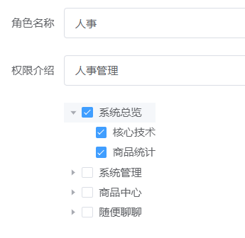

### nextTick 是什么

vue 中的 nextTick()实际上是一种优化策略。 当我们修改数据的时候，DOM 并不是立刻更新的，比如：

```javascript
<div id="app"> {{ message }} </div>;
const vm = new Vue({
  el: "#app",
  data: {
    message: "原始值",
  },
});
```

如果你更新了数据，立刻的就去通过 dom 获取数据

### 项目中为什么使用了 nextTick

在对角色管理页面中，编辑某一个角色的时候，我点击编辑按钮，需要知道点击的这个角色对应的权限有哪些，根据权限的不同，在复选框中勾选对应的位置  


所以在点击的时候，需要获取对应的角色的权限列表，接着拿到列表数据以后，就要立刻去设置对应的 DOM 元素。  
首先，vue 的数据改变了，并不是立刻更新  
其次，这个 tree 组件的数据也不是依赖权限列表数据的，而是你手动设置的  
所以，需要使用 nextTick()，
