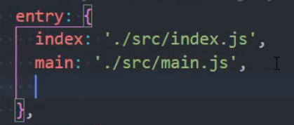
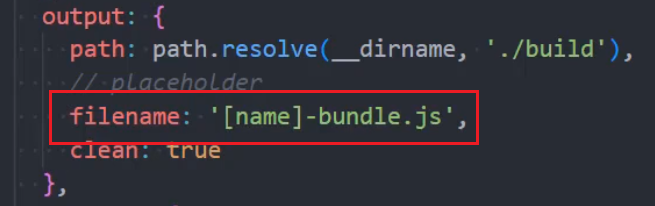
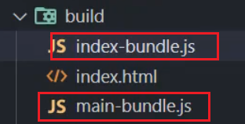
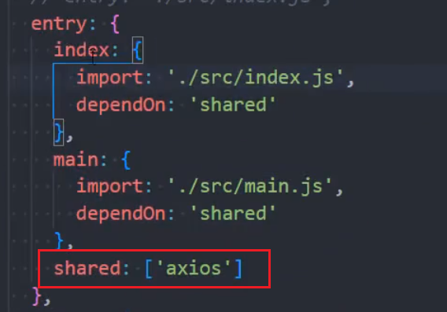
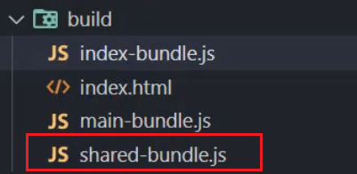
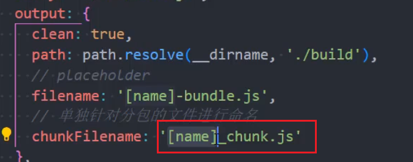
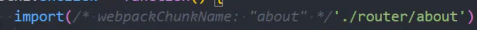
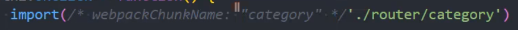
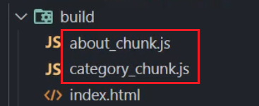

### 代码分离

将代码分离到不同的 bundle 中，之后按需加载，或者并行加载这些文件  
默认情况下，所有的 js 代码（业务代码、第三方依赖，暂时没有用到的模块），在首页全部加载，影响首页的渲染速度

代码分离可以分理出更小的 bundle，以及控制资源加载的优先级，提升代码的加载性能

### webpack 中代码分离的常用的三种方式：

- **多入口起点 **： 使用 entry 配置手动分离代码  
  

  多入口意味着出口不能写死，出口使用变量配置：  
  

  两个出口文件  
  

- **防止重复**： 使用 Entry Dependencies 或者 SplitChunksPlugin 去重和分离代码  
   多入口文件条件下，如果多个入口文件使用了同一个包，在打包的时候，这个包会被重复打包:

  配置共享模块  
  

  出口的共享模块被单独打包  
  

- **动态导入**：通过模块的内联函数( import("xxx") )来分离代码
  使用 `import('xx.js')/import('xxx.vue')`导入的文件，在最后打包的时候会形成一个单独的 js 文件，比如路由的懒加载，每一个路由下对应的文件形成一个单独的包，访问到该路由的时候才去下载

  对 `import()`导出文件的命名

  `webpack.config.js`配置  
  

  代码中使用魔法注释  
  
  

  打包以后形成的文件  
  

### SplitChunks 分包

webpack 中提供了 SplitChunksPlugin 默认的配置，我们也可以手动修改这个配置
